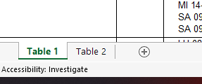
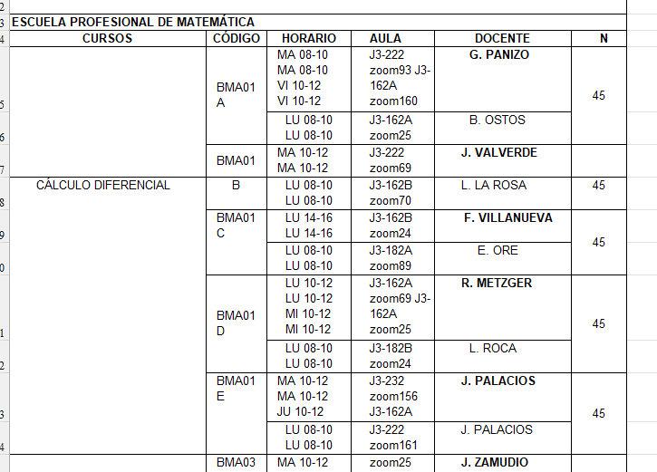
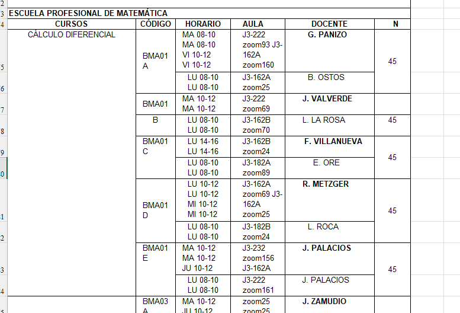

# UNI schedule PDF to JSON

The objective for this project is to parser into JSON file the FC schedule PDF with the objective of using it for future schedules projects

## PREPROCESSING

At first you need to convert the file to xlsx using :

https://smallpdf.com/es/pdf-a-excel

Be sure than the xlsx file is using just a unique table:



After that , convert the xlsx file to json using :

https://products.aspose.app/cells/es/conversion/excel-to-json

And now the data is ready for been procesing , be sure to place the json file in the root directory.

## RESULTS

```
interface Carreer {
    name: string
    courses: Array<Course>
}
```

```
interface Course {
    name: string;
    sections: Array<Section>
}
```

```
interface Section {
    code: string
    times: Array<SectionTime>
}
```

```
interface SectionTime {
    schedule: string
    teacher: string
}
```

## CONSIDERATIONS

Some courses will not been correctly generated , try to fix that errors manually

### Error



### Correction


